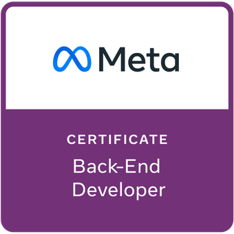

# Meta Back-end Developer Capstone

Building RESTful APIs using [Django Rest Framework](https://www.django-rest-framework.org/) connected to a [MySQL](https://dev.mysql.com/downloads/) as part of the [Meta Back-End Developer Certificate](https://www.coursera.org/professional-certificates/meta-back-end-developer) teached by [Meta](https://www.facebook.com/business/learn/back-end-back-end-developer-certificate-coursera).

    

META Back-End Developer Course Capstone Project implemented by Sayali Karad.

Please, see Readme.txt file for review process in Week4 of the course.
